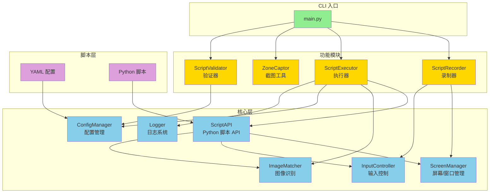
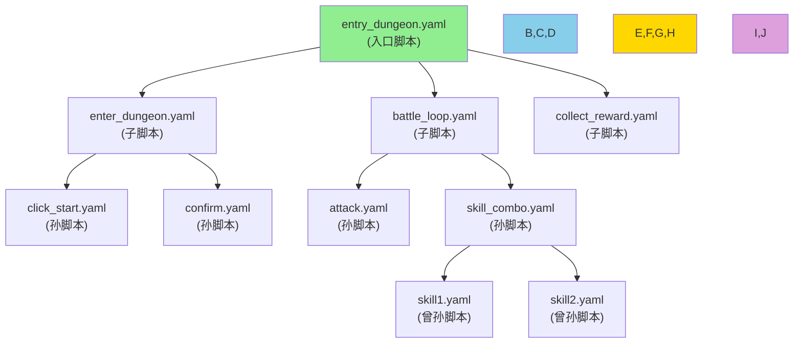
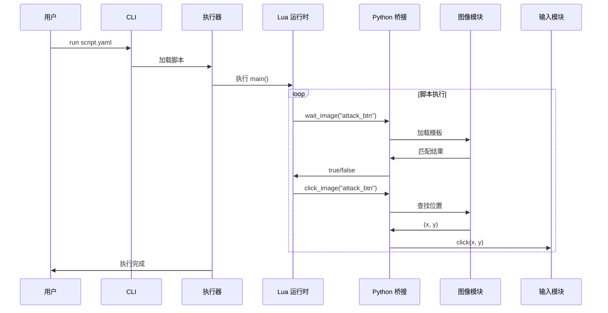
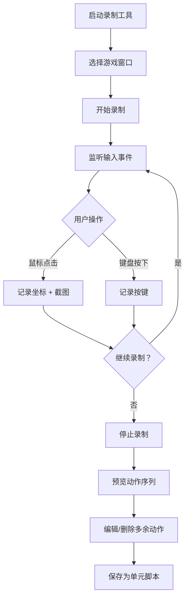

# Game Macro Automation 设计文档

## 1. 项目概述

**目标:** 构建一个基于 Python 的 Windows 游戏宏自动化系统，支持录制、编辑、执行宏脚本。

**项目类型:**
- **类型:** 桌面自动化工具
- **平台:** Windows only
- **语言:** Python 3.10+
- **构建:** setuptools + pyproject.toml
- **CI/CD:** 待配置

---

## 2. 核心设计理念

### 2.1 统一脚本架构
- 所有脚本都是单元脚本，没有"单元"和"编排"的区分
- 脚本可以调用其他脚本，形成层级结构
- 录制生成基础脚本，手动编辑添加复杂逻辑
- 顶层脚本作为入口，调用子脚本完成复杂流程

### 2.2 YAML+Python 混合方案
- **YAML 层 (数据):** 存储元数据、配置、资源引用、检测区域定义
- **Python 层 (逻辑):** 编写流程控制、条件判断、循环等逻辑

### 2.3 条件检测分离
- 录制阶段：只录动作，不录条件
- 编辑阶段：手动添加检测区域和条件逻辑
- 执行阶段：根据条件动态决定执行流

### 2.4 分辨率适配
- 所有坐标基于游戏窗口相对位置
- 自动检测分辨率并计算缩放因子
- 模板匹配使用相对尺寸

### 2.5 错误处理
- 子脚本执行失败时，父脚本停止执行（可配置）
- 可配置重试次数
- 详细日志记录失败原因

---

## 3. 系统架构



---

## 4. 模块列表

| 模块 | 说明 | 设计文档 |
|------|------|---------|
| **core** | 核心功能层（屏幕、输入、图像、配置、日志） | [core/README.md](core/README.md) |
| **recorder** | 录制器模块 | [recorder/README.md](recorder/README.md) |
| **executor** | 执行器模块 | [executor/README.md](executor/README.md) |
| **script** | 脚本验证和管理 | [script/README.md](script/README.md) |
| **tools** | 辅助工具（截图工具） | [tools/README.md](tools/README.md) |

---

## 5. 技术选型

| 组件 | 选型 | 理由 | 备选 |
|------|------|------|------|
| **主语言** | Python 3.10+ | 生态丰富，开发效率高 | - |
| **目标平台** | Windows only | 简化实现，专注 Windows 游戏 | 后续扩展跨平台 |
| **脚本格式** | YAML | 人类可读，易编辑 | JSON, TOML |
| **编排引擎** | Python | 统一技术栈，无需额外依赖 | Lua 嵌入 |
| **输入控制** | pyautogui + pynput | 成熟稳定，API 简单 | 直接 Win32 API |
| **图像识别** | pyautogui | 简单易用，内置模板匹配 | OpenCV |
| **窗口管理** | PyGetWindow | 跨窗口获取和定位 | Win32 GUI |
| **配置管理** | PyYAML | 简单易用 | TOML |

### 依赖清单

```txt
# 核心依赖
pyautogui>=0.9.54      # 鼠标键盘模拟、图像识别
pynput>=1.7.6          # 输入事件监听
numpy>=1.24.0          # 数组处理
Pillow>=10.0.0         # 图像处理
pyyaml>=6.0            # YAML 解析
pygetwindow>=0.0.9     # 窗口管理
pydantic>=2.0          # 配置验证（可选）

# 开发依赖
pytest>=7.0            # 测试框架
pytest-cov>=4.0        # 覆盖率
black>=23.0            # 代码格式化
ruff>=0.1.0            # 代码检查
mypy>=1.0              # 类型检查
```

---

## 5. 脚本设计

### 5.1 YAML 配置层

```yaml
meta:
  name: "副本流程"
  version: "1.0"
  description: "完整副本自动化"
  created_by: "manual"

config:
  window_title: "游戏窗口"
  log_level: "INFO"
  retry_times: 3
  default_timeout: 5000

assets:
  images:
    attack_btn: "assets/attack_btn.png"
    boss_hp: "assets/boss_hp.png"

scripts:
  attack: "attack.yaml"
  potion: "potion.yaml"

detection_zones:
  boss_hp_bar:
    image: "detection/boss_hp.png"
    confidence: 0.85
    region: [100, 50, 200, 30]

python_script: "scripts/dungeon_flow.py"
```

### 5.2 Python 逻辑层

```python
# 内置 API 由 executor 提供
# executor.wait_image(name, timeout) -> bool
# executor.click_image(name, confidence, offset)
# executor.image_exists(name, confidence) -> bool
# executor.run_script(name)
# executor.delay(ms)
# executor.log(message, level)

def main(executor):
    # 进入战斗
    if not executor.wait_image("attack_btn", 5000):
        executor.log("未找到攻击按钮", "ERROR")
        return False
    executor.click_image("attack_btn")
    executor.delay(500)
    
    # 战斗循环
    max_iterations = 100
    
    def attack_condition():
        return executor.image_exists("boss_hp_bar")
    
    def attack_body():
        if executor.image_exists("low_hp_warning"):
            executor.run_script("potion.yaml")
        else:
            executor.click_image("skill_1")
        executor.delay(1000)
    
    executor.loop_while(attack_condition, attack_body, max_iterations, 1000)
    
    # 领取奖励
    if executor.wait_image("reward_popup", 3000):
        executor.click_image("reward_popup")
    else:
        executor.log("未检测到奖励弹出", "WARNING")
    
    return True
```

### 5.2 Lua 逻辑层

```lua
-- 内置 API 由 Python 提供
-- wait_image(name, timeout) -> bool
-- click_image(name, confidence, offset)
-- image_exists(name, confidence) -> bool
-- run_script(name)
-- delay(ms)
-- log(message, level)

function main()
    -- 进入战斗
    if not wait_image("attack_btn", 5000) then
        log("未找到攻击按钮", "ERROR")
        return false
    end
    click_image("attack_btn")
    delay(500)
    
    -- 战斗循环
    local max_iterations = 100
    for i = 1, max_iterations do
        if not image_exists("boss_hp_bar") then
            log("Boss 已击败", "INFO")
            break
        end
        
        -- 血量检查
        if image_exists("low_hp_warning") then
            run_script("potion.yaml")
        else
            click_image("skill_1")
        end
        
        delay(1000)
    end
    
    -- 领取奖励
    if wait_image("reward_popup", 3000) then
        click_image("reward_popup", 0, 0)
    else
        log("未检测到奖励弹出", "WARNING")
    end
    
    return true
end
```

### 5.3 脚本层级示例



---

## 6. 核心 API 设计

### 6.1 Lua 内置 API (Python 提供)

| 函数 | 参数 | 返回 | 说明 |
|------|------|------|------|
| `wait_image` | name, timeout | bool | 等待图片出现 |
| `click_image` | name, confidence, offset | void | 点击图片 |
| `image_exists` | name, confidence | bool | 检查图片存在 |
| `run_script` | name | bool | 运行子脚本 |
| `delay` | ms | void | 延迟 |
| `log` | message, level | void | 日志 |
| `get_scale_factor` | - | float | 获取缩放因子 |
| `capture_screen` | region | image | 截图 |

### 6.2 Python 核心类

```python
# 核心层
ScreenManager      # 窗口查找、截图、缩放计算
InputController    # 鼠标键盘控制
ImageMatcher       # 模板匹配
LuaBridge          # Lua 运行时、函数注册
ConfigManager      # YAML 加载/保存
Logger             # 日志记录、执行报告

# 功能层
ScriptRecorder     # 录制输入、生成 YAML
ScriptExecutor     # 执行 Lua 脚本
ZoneCaptor         # 区域截图工具
ScriptValidator    # 脚本验证
ScriptManager      # 脚本管理、依赖树
```

---

## 7. 数据流设计

### 7.1 执行流程



### 7.2 录制流程



---

## 8. 错误处理设计

### 8.1 错误策略

```yaml
config:
  on_error: "stop"  # stop/retry/ignore
  retry_times: 3
  default_timeout: 5000
```

| 策略 | 行为 |
|------|------|
| `stop` | 立即停止执行 (默认) |
| `retry` | 重试，最多 retry_times 次 |
| `ignore` | 忽略错误继续执行 |

### 8.2 日志等级

| 等级 | 输出内容 | 使用场景 |
|------|---------|---------|
| `DEBUG` | 每个动作的详细参数、图像匹配得分 | 调试脚本 |
| `INFO` | 动作执行开始/结束、条件判断结果 | 正常运行 |
| `WARNING` | 非致命问题（如匹配度偏低、重试） | 需要注意 |
| `ERROR` | 动作失败、图像未找到、脚本停止 | 错误诊断 |

---

## 9. 目录结构

```
game-macro-automation/
├── pyproject.toml
├── requirements.txt
├── requirements-dev.txt
├── README.md
├── config.yaml                 # 全局配置
│
├── src/
│   ├── __init__.py
│   ├── main.py                 # CLI 入口
│   │
│   ├── core/
│   │   ├── __init__.py
│   │   ├── screen.py           # 屏幕/窗口管理
│   │   ├── input.py            # 输入控制
│   │   ├── image.py            # 图像识别
│   │   ├── config.py           # 配置管理
│   │   └── logger.py           # 日志系统
│   │
│   ├── executor/
│   │   ├── __init__.py
│   │   ├── executor.py         # 执行器
│   │   └── api.py              # Python 脚本 API
│   │
│   ├── recorder/
│   │   ├── __init__.py
│   │   └── recorder.py         # 录制器
│   │
│   ├── tools/
│   │   ├── __init__.py
│   │   └── zone_captor.py      # 截图工具
│   │
│   └── script/
│       ├── __init__.py
│       ├── schema.py           # Schema 定义
│       ├── validator.py        # 验证器
│       └── manager.py          # 脚本管理
│
├── scripts/                    # 脚本目录
│   ├── *.yaml                  # YAML 配置
│   └── *.py                    # Python 逻辑
│
├── assets/
│   ├── templates/              # 动作模板
│   └── detection/              # 检测区域
│
├── logs/                       # 日志输出
│
└── tests/
    ├── test_screen.py
    ├── test_input.py
    ├── test_image.py
    ├── test_executor.py
    └── test_api.py
```

---

## 10. 执行报告格式

```yaml
execution_report:
  script: "dungeon.yaml"
  start_time: "2026-03-16T10:00:00"
  end_time: "2026-03-16T10:05:00"
  duration_seconds: 300
  status: "success"  # success/failed/stopped
  steps_total: 50
  steps_completed: 50
  errors: []
  warnings:
    - "图像匹配度偏低：skill_1 (0.72)"
  python_logs: [...]
```

---

## 11. MVP 范围

MVP 阶段包含以下功能：

1. **基础功能**
   - 录制输入并生成 YAML 脚本
   - 执行 Python 编排脚本
   - pyautogui 图像识别

2. **截图工具**
   - 检测区域截图
   - 保存为 detection/*.png

3. **高级编排**
   - Python 条件分支
   - Python 循环
   - 子脚本调用

4. **日志系统**
   - 可配置日志等级
   - 控制台输出
   - 执行报告生成

---

## 12. 验收标准

1. ✅ 成功录制简单操作并生成 YAML
2. ✅ 成功执行录制生成的脚本
3. ✅ Python 编排脚本可调用子脚本
4. ✅ 图像识别准确率 > 90%
5. ✅ 支持 1920x1080 和 1280x720 分辨率
6. ✅ 所有单元测试通过
7. ✅ 代码覆盖率 > 80%

---

## 13. 下一步

1. ✅ 搭建项目骨架
2. ✅ 实现核心模块（screen/input/image/config/logger）
3. ✅ 实现录制器 MVP
4. ✅ 实现执行器 MVP
5. ✅ 实现检测区域截图工具
6. ⏳ 编写单元测试
7. ⏳ 集成测试 + 迭代
