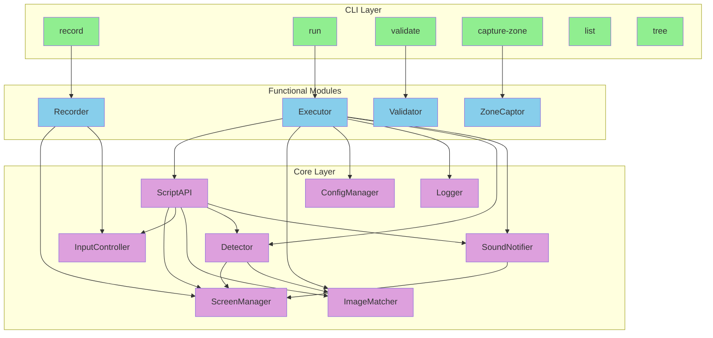
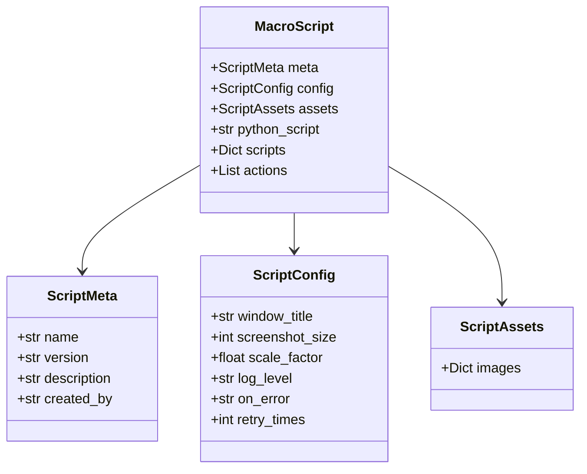
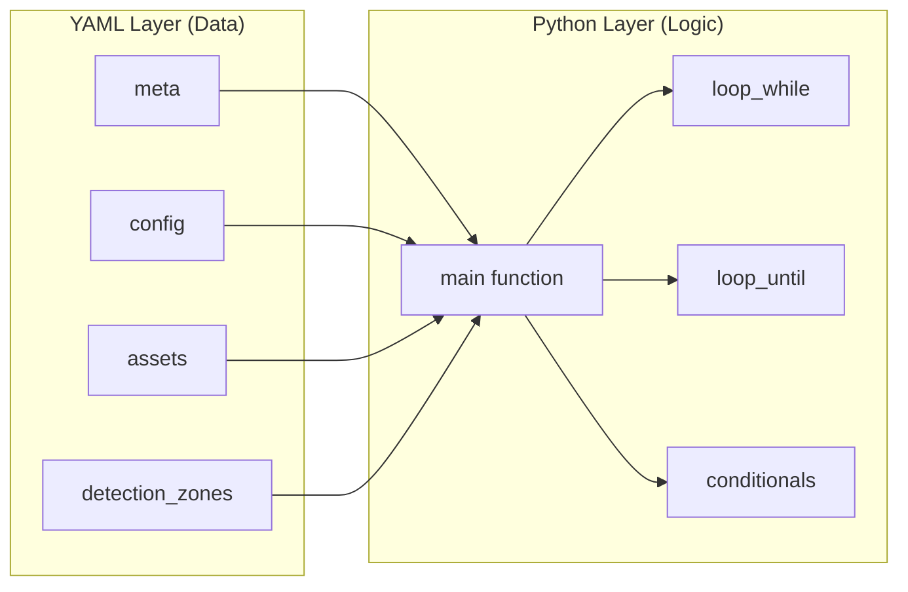
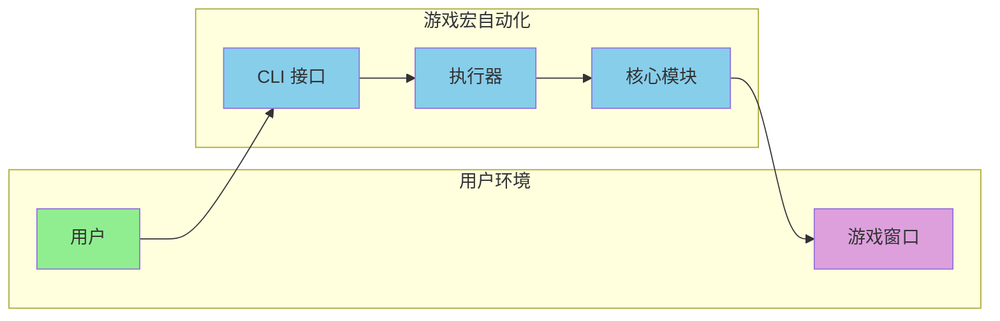

# 设计文档

## 概述

**项目定位：** 基于 Python 的 Windows 游戏宏自动化系统
**核心价值：** 录制鼠标键盘操作 → 生成脚本 → 通过图像识别自动执行

## 架构


```mermaid
graph TD
    subgraph CLI["CLI Layer"]
        CLI1[record]
        CLI2[run]
        CLI3[validate]
        CLI4[capture-zone]
        CLI5[list]
        CLI6[tree]
    end

    subgraph Module["Functional Modules"]
        REC[Recorder]
        EXE[Executor]
        VAL[Validator]
        ZC[ZoneCaptor]
    end

    subgraph Core["Core Layer"]
        SM[ScreenManager]
        IC[InputController]
        IM[ImageMatcher]
        CM[ConfigManager]
        LOG[Logger]
        SA[ScriptAPI]
        DD[Detector]
        SN[SoundNotifier]
    end

    CLI1 --> REC
    CLI2 --> EXE
    CLI3 --> VAL
    CLI4 --> ZC

    REC --> SM
    REC --> IC
    EXE --> SA
    EXE --> IM
    EXE --> CM
    EXE --> LOG
    EXE --> DD
    EXE --> SN

    SA --> SM
    SA --> IC
    SA --> IM
    SA --> DD
    SA --> SN
    DD --> SM
    DD --> IM
    SN --> SM

    classDef cli fill:#90EE90
    classDef module fill:#87CEEB
    classDef core fill:#DDA0DD
    class CLI1,CLI2,CLI3,CLI4,CLI5,CLI6 cli
    class REC,EXE,VAL,ZC module
    class SM,IC,IM,CM,LOG,SA,DD,SN core
```

## 模块

| Module | Responsibility | Documentation |
|--------|---------------|---------------|
| core | Screen, input, image, config, logging | [core/](core/README.md) |
| core/detector | Region-based template detection | - |
| core/sound | Sound notification (system/file) | - |
| recorder | Record mouse/keyboard → YAML | [recorder/](recorder/README.md) |
| executor | Execute Python scripts with API | [executor/](executor/README.md) |
| script | YAML validation and management | [script/](script/README.md) |
| tools | Zone capture utility | [tools/](tools/README.md) |

## 数据模型


```mermaid
classDiagram
    class MacroScript {
        +ScriptMeta meta
        +ScriptConfig config
        +ScriptAssets assets
        +str python_script
        +Dict scripts
        +List actions
    }

    class ScriptMeta {
        +str name
        +str version
        +str description
        +str created_by
    }

    class ScriptConfig {
        +str window_title
        +int screenshot_size
        +float scale_factor
        +str log_level
        +str on_error
        +int retry_times
    }

    class ScriptAssets {
        +Dict images
    }

    MacroScript --> ScriptMeta
    MacroScript --> ScriptConfig
    MacroScript --> ScriptAssets
```

## 技术决策

| Decision | Choice | Rationale |
|----------|--------|-----------|
| Script format | YAML + Python | Human-readable + powerful logic |
| Image recognition | pyautogui | Mature, simple API |
| Input control | pyautogui + pynput | Stable, cross-platform |
| Window management | PyGetWindow | Simple window lookup |
| Resolution adaptation | Auto-scale factor | Support multiple resolutions |

## API 设计

### 脚本 API（executor 提供）

| Method | Parameters | Returns | Description |
|--------|------------|---------|-------------|
| `click_image` | name, confidence=0.8 | void | Click matched image |
| `image_exists` | name, confidence=0.8 | bool | Check image exists |
| `wait_image` | name, timeout=5000 | bool | Wait for image |
| `run_script` | name | bool | Run sub-script |
| `delay` | ms | void | Delay in milliseconds |
| `log` | message, level | void | Log message |
| `loop_while` | condition, body, max_iter, interval | void | Loop while condition true |
| `loop_times` | count, body, delay_ms | void | Loop fixed times |
| `loop_until` | condition, body, timeout, interval | void | Loop until condition true |
| `detect_in_region` | region, template_name, confidence | List[MatchResult] | Detect templates in percentage region |
| `monitor_icon_state` | region, normal, changed, interval, on_changed | bool | Monitor state change with callback |

### 区域检测

#### 区域格式（百分比）

```python
region = {
    "x": (0.0, 0.5),  # Left-closed, right-open interval: 0% to 50% of screen width
    "y": (0.0, 1.0)   # 0% to 100% of screen height
}
```

- **坐标系**：屏幕绝对坐标
- **参考**：当前屏幕（主屏）或 screen_id 指定的屏幕
- **左 (x=0)** 到 **右 (x=1)**，**上 (y=0)** 到 **下 (y=1)**

#### detect_in_region

检测模板在指定百分比区域内的所有匹配。

```python
results = executor.detect_in_region(
    region={"x": (0.4, 0.6), "y": (0.1, 0.2)},  # Percentage region
    template_name="boss_icon",                   # Template name in assets
    confidence=0.8                               # Optional, default 0.8
) -> List[MatchResult]
```

#### monitor_icon_state

持续监测图标状态变化，状态变化时播放声音并触发回调。

```python
# Monitor state change with callback
def on_state_change(new_state: str):  # "normal", "changed", or "none"
    executor.log(f"State changed to: {new_state}")

changed, coords = executor.monitor_icon_state(
    region={"x": (0.4, 0.6), "y": (0.1, 0.2)},
    normal_template="boss_hp_normal",
    changed_template="boss_hp_low",
    interval_ms=2000,
    on_changed=on_state_change,
    sound={"type": "system"},  # or {"type": "file", "file": "alert.wav"}
    timeout=60000              # Optional, default no timeout
)

# Returns: (bool, tuple) -> (changed, (screen_x, screen_y))
# (True, (960, 540)) - icon changed, return full-screen coordinates
# (False, None) - timeout or no change detected
```

# 监控状态返回：
- `"none"`: No icon detected
- `"normal"`: Original icon detected
- `"changed"`: Icon has changed

#### MatchResult

```python
@dataclass
class MatchResult:
    x: int          # Center X relative to region (0 = left edge of region)
    y: int          # Center Y relative to region
    width: int      # Match width
    height: int     # Match height
    confidence: float
    screen_x: int   # Absolute screen coordinate X
    screen_y: int   # Absolute screen coordinate Y
```

### 术语表

| Term | Format | Example |
|------|--------|---------|
| Region | `{"x": (float, float), "y": (float, float)}` | `{"x": (0.0, 0.5), "y": (0.0, 1.0)}` |
| Percentage | Float 0.0-1.0 | 0.5 = 50% |
| Sound config | `{"type": "system" \| "file", "file": str}` | `{"type": "file", "file": "alert.wav"}` |
| State | String "normal" \| "changed" | `"normal"` |

## 脚本架构


```mermaid
graph LR
    subgraph YAML["YAML Layer (Data)"]
        Y1[meta]
        Y2[config]
        Y3[assets]
        Y4[detection_zones]
    end

    subgraph Python["Python Layer (Logic)"]
        P1[main function]
        P2[loop_while]
        P3[loop_until]
        P4[conditionals]
    end

    Y1 --> P1
    Y2 --> P1
    Y3 --> P1
    Y4 --> P1
    P1 --> P2
    P1 --> P3
    P1 --> P4
```

```yaml
# YAML: metadata, config, assets
meta:
  name: "Battle Flow"
config:
  window_title: "Game"
assets:
  images:
    attack_btn: "assets/attack_btn.png"
python_script: "battle.py"
```

## 安全考虑

- **本地执行** - 所有自动化都在本地运行，无远程访问
- **窗口隔离** - 操作限定在特定游戏窗口
- **无外部网络调用** - 纯本地桌面自动化
- **凭证处理** - 不存储凭证；游戏凭证由用户直接输入
- **输入模拟安全** - 鼠标/键盘模拟仅限于录制的操作

## 部署


```mermaid
graph LR
    subgraph 用户环境["用户环境"]
        USER[用户]
        GAME[游戏窗口]
    end

    subgraph 应用["游戏宏自动化"]
        CLI[CLI 接口]
        EXE[执行器]
        CORE[核心模块]
    end

    USER --> CLI
    CLI --> EXE
    EXE --> CORE
    CORE --> GAME

    classDef user fill:#90EE90
    classDef app fill:#87CEEB
    classDef target fill:#DDA0DD
    class USER,GAME user
    class CLI,EXE,CORE app
    class GAME target
```

### 安装

```bash
# 克隆并安装
git clone <repo>
cd GameMacroAutomation
pip install -r requirements.txt

# 运行 CLI
python -m src.main --help
```

### 配置

- 脚本目录：`scripts/`
- 资源目录：`assets/`
- 日志目录：`logs/`
- 配置：YAML 文件位于 scripts 目录