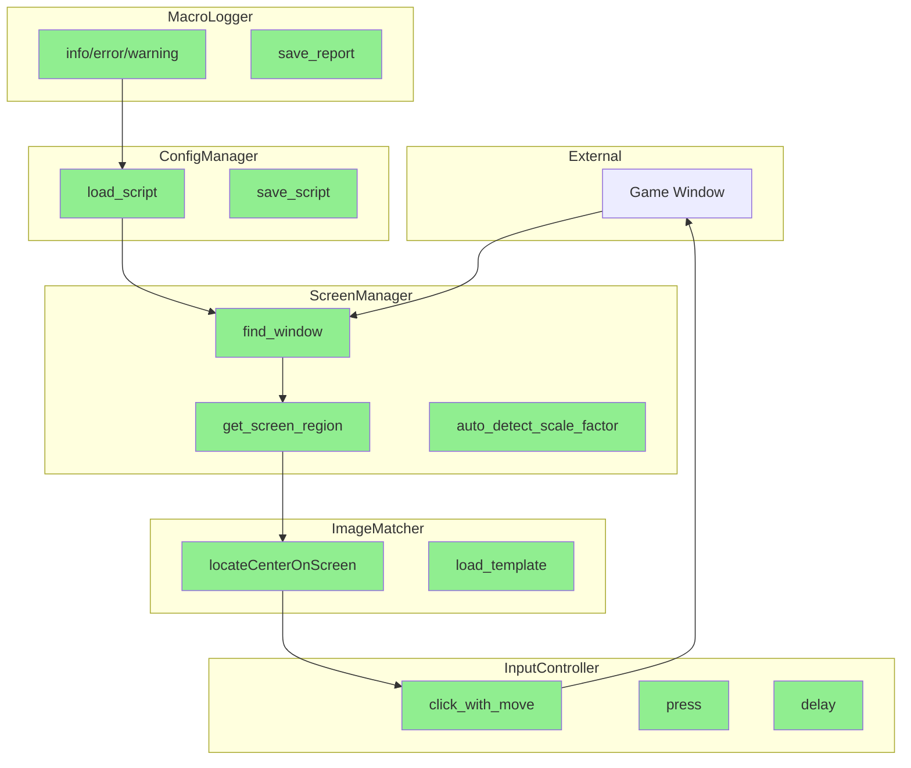
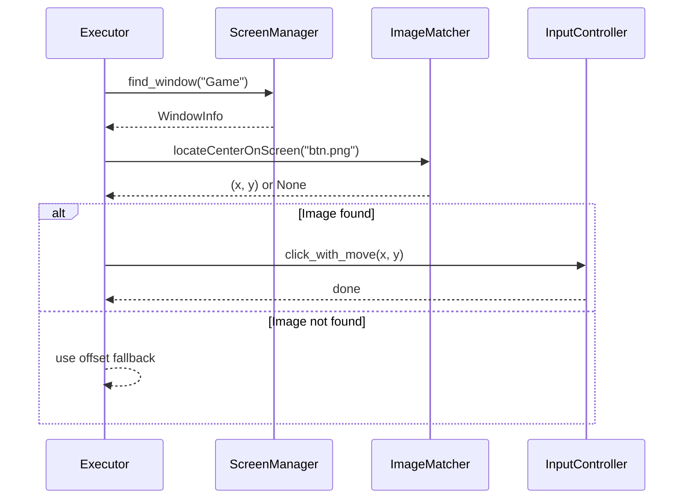
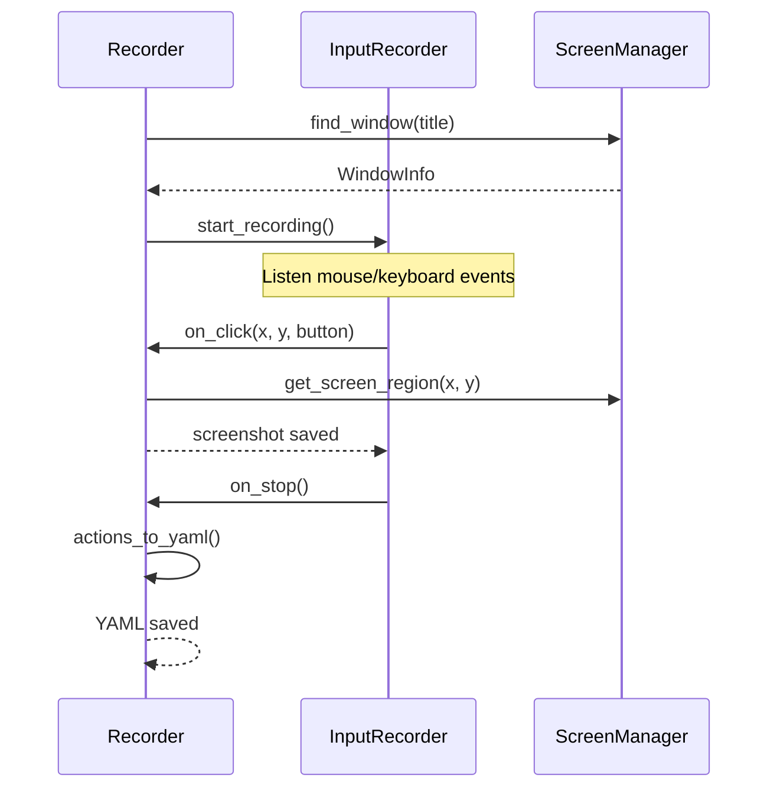

# Core 模块设计

## Overview

**职责：** 提供游戏宏自动化的底层能力
- 窗口管理与截图
- 鼠标键盘模拟与监听
- 图像识别（模板匹配）
- YAML 配置加载
- 日志记录与执行报告

**非职责：** 脚本执行逻辑、录制流程控制

## Architecture

## Interfaces

| Class | Public Methods | Description |
|-------|---------------|-------------|
| `WindowInfo` | title, left, top, width, height | 窗口信息数据类 |
| `ScreenManager` | find_window, get_screen_region, auto_detect_scale_factor | 窗口与截图管理 |
| `InputController` | click_with_move, press, delay, get_stats | 输入控制 |
| `ImageMatcher` | locate_center_on_screen, load_template | 图像识别 |
| `ConfigManager` | load_script, save_script | YAML 配置管理 |
| `MacroLogger` | info, error, start_execution, save_report | 日志系统 |

## Key Sequences

### 执行脚本流程

### 录制流程

## Error Handling

| Error Type | Handling |
|------------|----------|
| Window not found | Raise `WindowNotFoundError` |
| Screenshot failed | Fallback to full screen |
| Image not found | Log warning, return None |
| YAML parse error | Raise `YAMLError` with details |

## Testing Strategy

| Test Type | Coverage |
|-----------|----------|
| Unit | ScreenManager.find_window, InputController.click |
| Mock | pyautogui, PIL.ImageGrab |
| Integration | Screen + Image recognition |

## Future Improvements

- [ ] Add cross-platform screen capture (currently Windows only)
- [ ] Support multiple monitor configurations
- [ ] Optimize image matching performance with caching