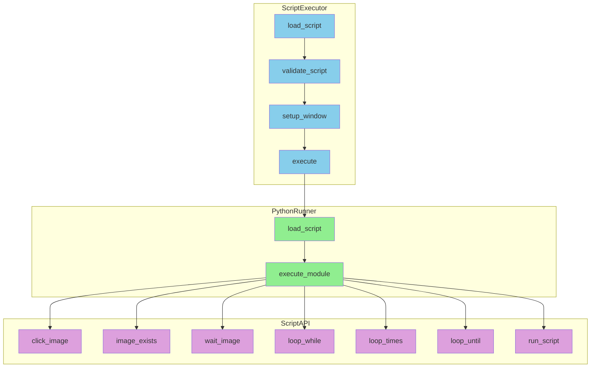
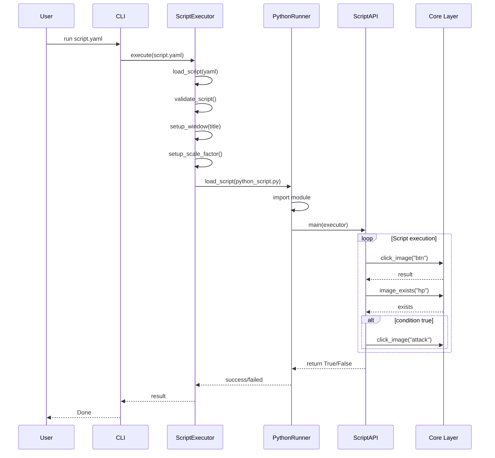

# Executor 模块设计

## Overview

**职责：** 执行 Python 脚本，提供图像识别、输入控制、循环控制等 API
- 加载并执行 YAML + Python 混合脚本
- 为 Python 脚本提供自动化 API
- 错误处理与重试机制

**非职责：** 录制功能、脚本验证

## Architecture



## Interfaces

| Class | Public Methods | Description |
|-------|---------------|-------------|
| `ScriptExecutor` | execute, setup_logging, setup_window | 执行器主模块 |
| `PythonRunner` | load_script, execute | Python 脚本加载执行 |
| `ScriptAPI` | click_image, wait_image, loop_while, etc. | 脚本 API 封装 |

## Key Sequences

### Python 脚本执行流程



### 循环控制流程

```mermaid
sequenceDiagram
    participant SCRIPT as Python Script
    participant API as ScriptAPI
    participant EXE as Executor

    SCRIPT->>API: loop_while(condition, body, 100, 1000)
    
    loop max_iterations=100
        API->>EXE: call condition()
        EXE-->>API: True/False
        
        alt condition is True
            API->>EXE: call body()
            EXE-->>API: result
            API->>API: delay(1000)
        else condition is False
            API-->>SCRIPT: loop completed
            break
        end
    end
```

## Error Handling

| Strategy | Behavior |
|----------|----------|
| `stop` | 立即停止执行（默认） |
| `retry` | 重试 retry_times 次后停止 |
| `ignore` | 忽略错误继续执行 |

```yaml
config:
  on_error: "stop"    # stop / retry / ignore
  retry_times: 3
  default_timeout: 5000
```

## Testing Strategy

| Test Type | Coverage |
|-----------|----------|
| Unit | execute, load_script, validate_script |
| Integration | Full script execution with mocked core |
| Mock | ScreenManager, ImageMatcher, InputController |

## monitor_icon_state - 图标状态监测

### 背景问题

原有 `monitor_icon_state` 使用 pyautogui 模板匹配，存在两个问题：
1. **多形态变化**：变化后的图标可能有多种形态（如 icon_after.png, icon_after2.png），单模板无法覆盖
2. **同形异色误匹配**：pyautogui 底层使用灰度+归一化模板匹配，形状相同但颜色不同的图标会误识别为 normal

### 解决方案

1. **`changed_template` 支持列表**：同时检测多个 changed 模板，任一匹配 → changed
2. **新增 `color_mode` 参数**：支持 `"template"`（模板匹配）或 `"histogram"`（直方图对比）
3. **`histogram` 模式**：截取 region 区域子图，与模板图做颜色直方图对比，解决同形异色问题

### API 接口

```python
def monitor_icon_state(
    region: dict,
    normal_template: str,
    changed_template: Union[str, List[str]],  # 支持列表
    color_mode: str = "template",              # "template" | "histogram"
    histogram_threshold: float = 0.7,          # 直方图相似度阈值
    interval_ms: int = 2000,
    on_changed: Optional[Callable[[str], None]] = None,
    sound: Optional[dict] = None,
    timeout: Optional[int] = None,
) -> Tuple[bool, Optional[Tuple[int, int]]]:
```

### color_mode 行为

| mode | normal 检测 | changed 检测 | changed 判定 |
|------|------------|-------------|-------------|
| "template" | locateOnScreen(normal) | 遍历 changed_template 列表，逐个 locateOnScreen | 任一匹配 → changed |
| "histogram" | 截取 region → compute_histogram → 对比模板 | 遍历 changed_template 列表，逐个直方图对比 | 任一相似度 > threshold → changed |

### histogram 模式原理

1. 截取 `region` 区域子图
2. resize 到模板图片尺寸
3. 转 BGR → `cv2.calcHist` 计算颜色直方图
4. `cv2.compareHist(h1, h2, cv2.HISTCMP_CORREL)` 计算相似度
5. 返回 0-1 相似度，> threshold 判定为"相似"（即 unchanged）
6. 相似度 < threshold → 判定为 changed

### YAML 配置示例

```yaml
# scripts/attack.yaml
assets:
  images:
    icon_before: "images/icon_before.png"
    icon_after: "images/icon_after.png"
```

```python
# attack.py
def main(executor):
    changed, coords = executor.monitor_icon_state(
        region={"x": (0.4, 0.6), "y": (0.1, 0.2)},
        normal_template="icon_before",
        changed_template="icon_after",
        color_mode="histogram",
        histogram_threshold=0.7,
        interval_ms=500,
        timeout=60000
    )
```

### 向后兼容

- `color_mode` 默认 `"template"` → 旧脚本不传参行为不变
- `changed_template` 传字符串 → 自动转为单元素列表处理

### 术语表

| 术语 | 含义 |
|------|------|
| region | 屏幕检测区域，百分比格式 `{"x": (0.0, 1.0), "y": (0.0, 1.0)}` |
| color_mode | 颜色检测模式：`"template"` 模板匹配 / `"histogram"` 直方图对比 |
| histogram_threshold | 直方图相似度阈值，0-1，越高越严格 |
| changed_template | 变化后图标，支持 `str` 或 `List[str]` |

## Future Improvements

- [ ] Add async execution support
- [ ] Support cancellation during execution
- [ ] Add execution profiling/tracing