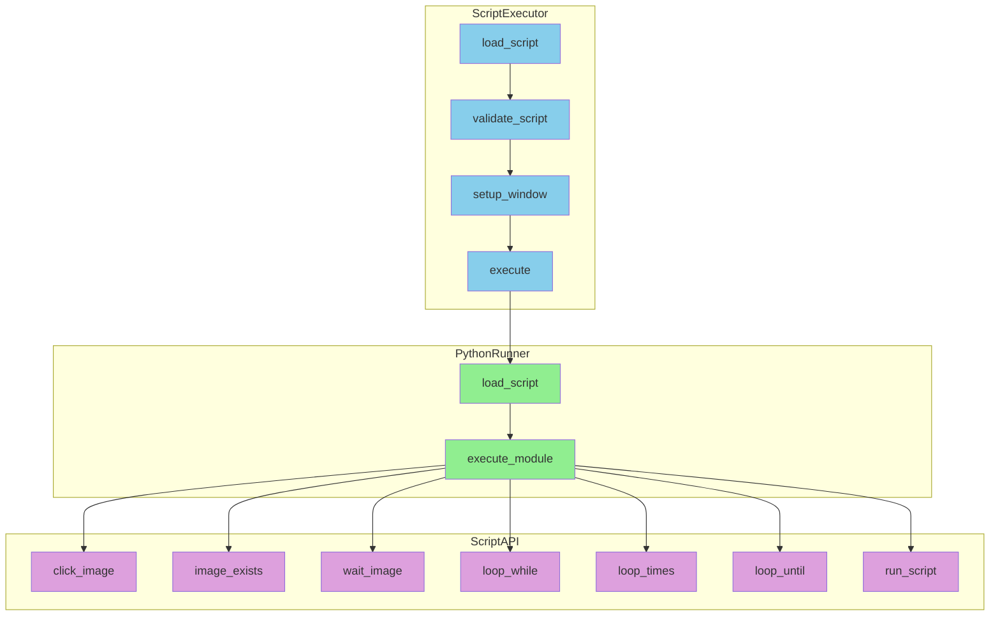
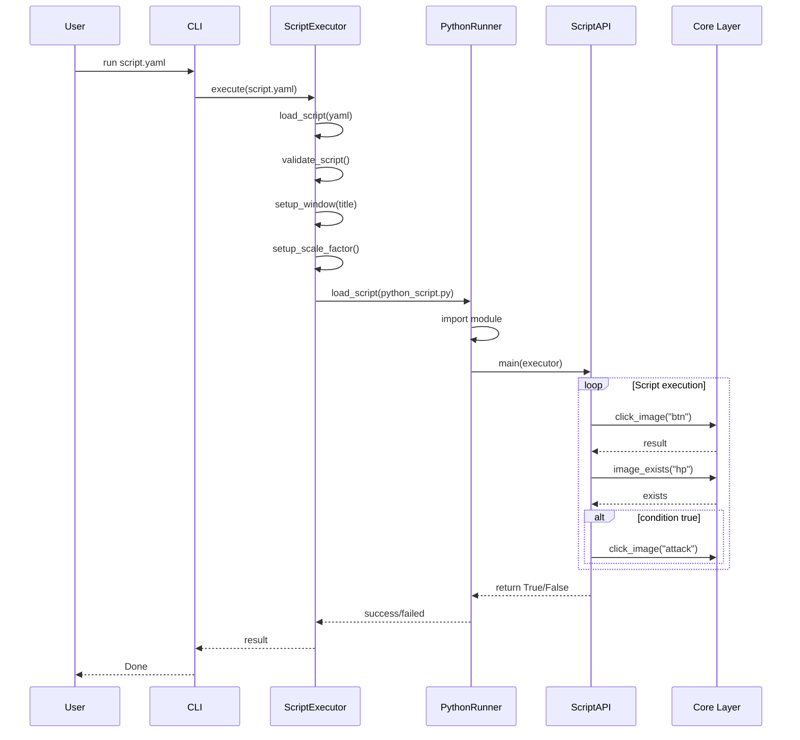

# Executor 模块设计

## Overview

**职责：** 执行 Python 脚本，提供图像识别、输入控制、循环控制等 API
- 加载并执行 YAML + Python 混合脚本
- 为 Python 脚本提供自动化 API
- 错误处理与重试机制

**非职责：** 录制功能、脚本验证

## Architecture



## Interfaces

| Class | Public Methods | Description |
|-------|---------------|-------------|
| `ScriptExecutor` | execute, setup_logging, setup_window | 执行器主模块 |
| `PythonRunner` | load_script, execute | Python 脚本加载执行 |
| `ScriptAPI` | click_image, wait_image, loop_while, etc. | 脚本 API 封装 |

## Key Sequences

### Python 脚本执行流程



### 循环控制流程

```mermaid
sequenceDiagram
    participant SCRIPT as Python Script
    participant API as ScriptAPI
    participant EXE as Executor

    SCRIPT->>API: loop_while(condition, body, 100, 1000)
    
    loop max_iterations=100
        API->>EXE: call condition()
        EXE-->>API: True/False
        
        alt condition is True
            API->>EXE: call body()
            EXE-->>API: result
            API->>API: delay(1000)
        else condition is False
            API-->>SCRIPT: loop completed
            break
        end
    end
```

## Error Handling

| Strategy | Behavior |
|----------|----------|
| `stop` | 立即停止执行（默认） |
| `retry` | 重试 retry_times 次后停止 |
| `ignore` | 忽略错误继续执行 |

```yaml
config:
  on_error: "stop"    # stop / retry / ignore
  retry_times: 3
  default_timeout: 5000
```

## Testing Strategy

| Test Type | Coverage |
|-----------|----------|
| Unit | execute, load_script, validate_script |
| Integration | Full script execution with mocked core |
| Mock | ScreenManager, ImageMatcher, InputController |

## Future Improvements

- [ ] Add async execution support
- [ ] Support cancellation during execution
- [ ] Add execution profiling/tracing