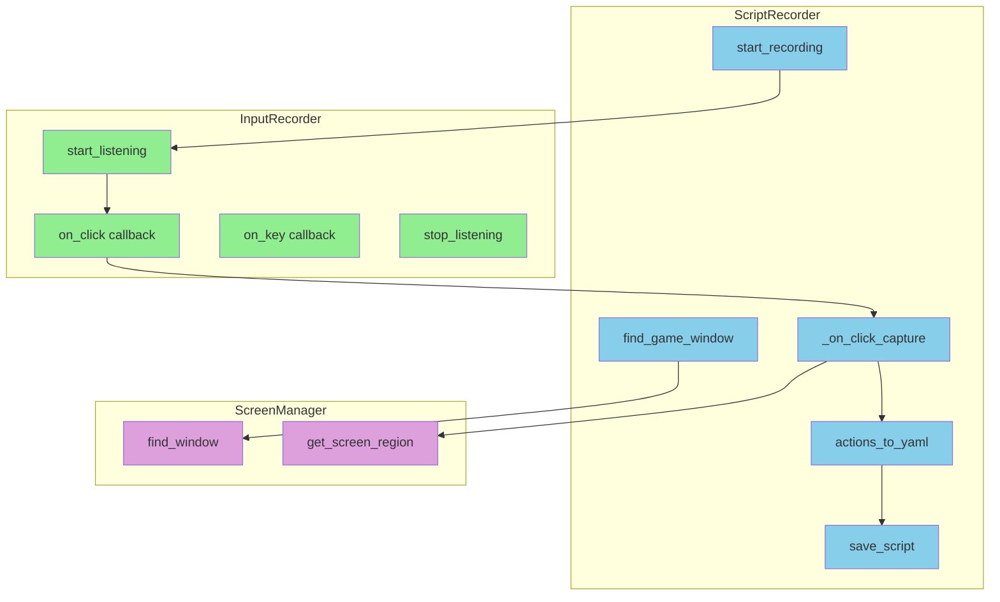
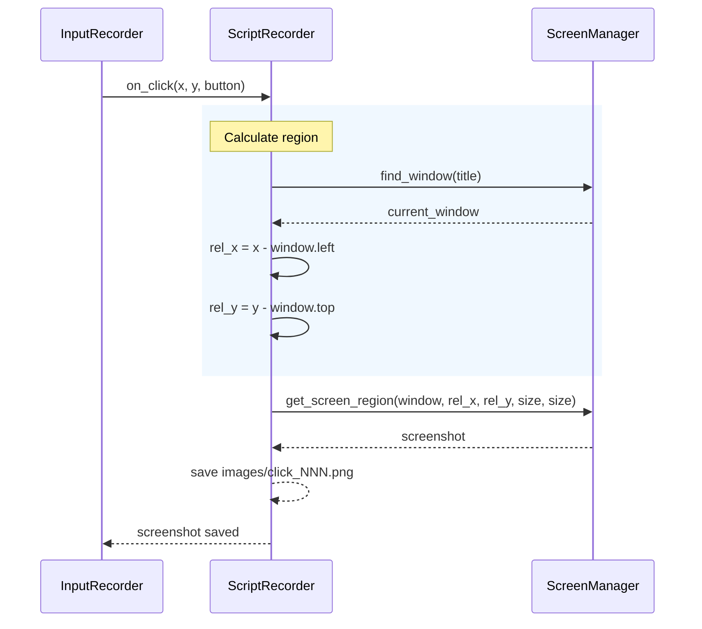

# Recorder 模块设计

## Overview

**职责：** 录制用户的鼠标键盘操作，生成 YAML 脚本和截图资源
- 监听输入事件（鼠标点击、键盘按键）
- 点击时自动截图保存
- 生成可执行的 YAML 脚本

**非职责：** 脚本执行、图像识别

## Architecture



## Interfaces

| Class | Public Methods | Description |
|-------|---------------|-------------|
| `ScriptRecorder` | record, start_recording, stop_recording, save_script | 录制器主模块 |
| `InputRecorder` | start_listening, stop_listening, actions | 输入事件监听 |

## Key Sequences

### 录制流程

```mermaid
sequenceDiagram
    participant USER as User
    participant REC as ScriptRecorder
    participant IR as InputRecorder
    participant SM as ScreenManager

    USER->>REC: record("Game Window", "test")
    REC->>SM: find_window("Game Window")
    SM-->>REC: WindowInfo
    REC->>IR: start_recording()
    
    Note over IR: Listening for events...
    
    USER->>GAME: Click in game
    GAME->>IR: mouse_click(x, y)
    IR->>REC: on_click(x, y, button)
    REC->>SM: get_screen_region(window, x, y)
    SM-->>REC: screenshot
    REC-->>REC: save to images/click_001.png
    
    USER->>IR: Press F12 to stop
    IR->>REC: stop_recording()
    REC->>REC: actions_to_yaml()
    REC-->>REC: save test.yaml
    REC-->>USER: Script saved
```



### 点击截图流程



## Error Handling

| Error Type | Handling |
|------------|----------|
| Window not found | Show list of available windows |
| Screenshot failed | Fallback to screen coordinates |
| YAML save failed | Raise exception with path |

## Testing Strategy

| Test Type | Coverage |
|-----------|----------|
| Unit | actions_to_yaml, save_script |
| Mock | ScreenManager, InputRecorder |
| Integration | Full recording flow |

## YAML Output Format

```yaml
meta:
  name: "Recording"
  version: "1.0"
  created_by: "recorder"

config:
  window_title: "Game Window"
  log_level: "INFO"

assets:
  images:
    click_001: "images/click_001.png"

actions:
  - type: "click_image"
    image: "click_001"
    offset: [1339, 1548]
  - type: "delay"
    ms: 200
  - type: "keypress"
    key: "a"
```

## Future Improvements

- [ ] Add pause/resume recording
- [ ] Support editing actions after recording
- [ ] Add preview before saving