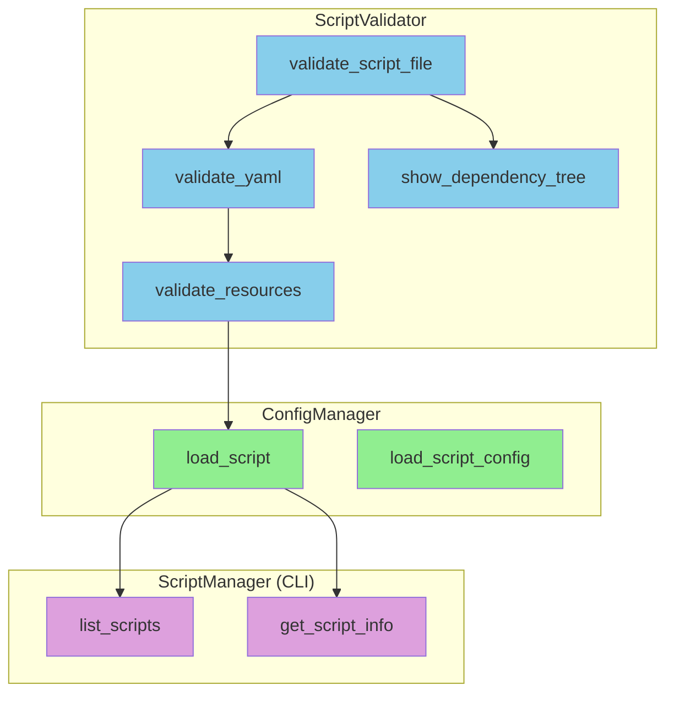
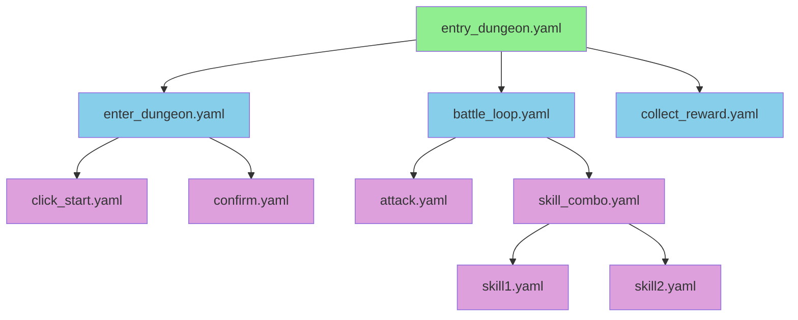

# Script 模块设计

## 概述

**职责：** YAML 脚本的验证和管理
- Schema 定义
- 脚本验证（文件存在、YAML 解析、资源引用）
- 依赖树分析
- 脚本列表管理

**非职责：** 脚本执行、录制功能

## 架构



## 接口

| Class | Public Methods | Description |
|-------|---------------|-------------|
| `ValidationError` | - | 验证错误异常 |
| `ScriptValidator` | validate_script_file, show_dependency_tree | 脚本验证器 |
| `ConfigManager` | load_script, load_script_config | 配置加载器 |

## 验证规则

| Check | Description |
|-------|-------------|
| File exists | YAML 文件必须存在 |
| YAML parse | 必须是有效的 YAML 格式 |
| meta.name | 必需的元数据字段 |
| python_script | 文件存在（如果引用） |
| scripts.* | 子脚本引用必须存在 |
| assets.images.* | 图片资源必须存在 |

## 依赖树



## YAML 模式

```yaml
meta:
  name: string          # Required
  version: string       # Optional
  description: string   # Optional
  created_by: string    # Optional: recorder/manual

config:
  window_title: string      # Optional
  log_level: string         # Optional: DEBUG/INFO/WARNING/ERROR
  on_error: string          # Optional: stop/retry/ignore
  retry_times: int          # Optional
  default_timeout: int      # Optional

assets:
  images:
    key: "path/to/image.png"

scripts:
  key: "path/to/script.yaml"

detection_zones:
  key:
    image: string
    confidence: float
    region: [x, y, w, h]

python_script: "path/to/script.py"  # Optional
actions: []                           # Optional
```

## 错误处理

| Error Type | Message |
|------------|---------|
| File not found | `文件不存在：{path}` |
| YAML parse error | `YAML 解析失败：{detail}` |
| Missing meta.name | `缺少必需的 meta.name 字段` |
| Resource not found | `资源不存在：{type} [{key}]` |

## 测试策略

| Test Type | Coverage |
|-----------|----------|
| Unit | validate_script_file, show_dependency_tree |
| Integration | validate with real YAML files |

## 未来改进

- [ ] Add schema validation with pydantic
- [ ] Support script versioning
- [ ] Add script template generation