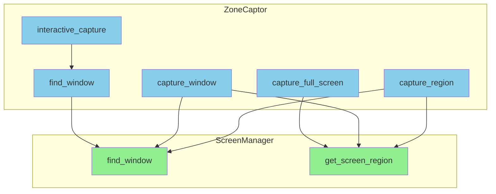
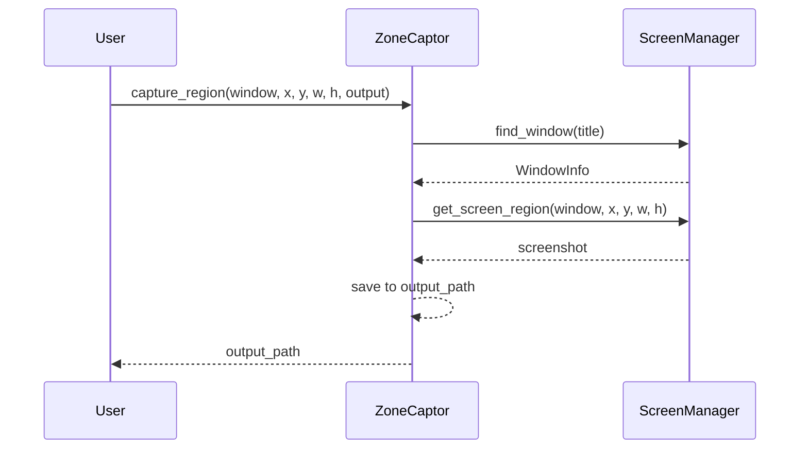

# Tools 模块设计

## Overview

**职责：** 辅助工具集
- 检测区域截图
- 交互式截图（说明模式）

**非职责：** 脚本执行、录制、验证

## Architecture



## Interfaces

| Class | Public Methods | Description |
|-------|---------------|-------------|
| `ZoneCaptor` | capture_full_screen, capture_window, capture_region, interactive_capture | 截图工具 |

## Key Sequences

### 区域截图流程



## Screenshot Methods

| Method | Use Case |
|--------|----------|
| `capture_full_screen` | 完整屏幕截图 |
| `capture_window` | 整个游戏窗口 |
| `capture_region` | 指定区域（相对窗口或全屏坐标） |
| `interactive_capture` | 显示交互式截图说明 |

## CLI Usage

```bash
# 全屏截图
python -m src.main capture-zone --output assets/detection/full.png

# 指定窗口
python -m src.main capture-zone --output assets/detection/window.png -w "Game Window"

# 不指定窗口时列出可用窗口
python -m src.main capture-zone --output assets/detection/xxx.png
```

## Screenshot Size Guide

| Usage | Recommended Size |
|-------|-----------------|
| Button/Icon | 50x50 - 100x100 |
| HP Bar/Status | 200x30 - 300x50 |
| Popup/Dialog | 200x200 - 400x300 |

## Error Handling

| Error Type | Handling |
|------------|----------|
| Window not found | Show available windows |
| Screenshot failed | Raise exception with details |
| Output path invalid | Show path validation error |

## Testing Strategy

| Test Type | Coverage |
|-----------|----------|
| Unit | capture_region with mocked PIL |
| Integration | Real screenshot operations |

## Future Improvements

- [ ] Add cross-platform screenshot support
- [ ] Add interactive region selection GUI
- [ ] Add screenshot preview before saving