## 需求

## 状态机

### 状态说明

| 状态 | 含义 |
|------|------|
| `WAIT_READY` | 等待抛竿准备 |
| `WAIT_SINK` | 抛竿后等待下沉到目标（锁轮） |
| `JIGGING` | 抽动状态（`'` 按/松循环），等待上鱼 |
| `REELING_FISH` | 中鱼收线中（长按 `;`+`'` 组合键） |

### 下沉目标模式

| 模式 | 目标图 | 切换 |
|------|--------|------|
| `bottom` | `04_move_in_bottom`（沉底） | `ctrl+alt+[` |
| `depth15` | `05_depth_15`（下沉到 15m） | `ctrl+alt+[` |

### 状态跳转表（检测频率 0.5s）

| # | 当前状态 | 检测事件(0.5s) | 动作 | 目标状态 |
|---|---------|---------------|------|---------|
| T1 | WAIT_READY | `01_ready` 出现 | tap `;` | WAIT_SINK |
| T2 | WAIT_SINK | 目标图（`04`/`05` 按模式）出现 | tap `;` 锁轮 | JIGGING |
| T3 | JIGGING | `02_on_fish` 出现 | 停抽动 | REELING_FISH |
| T4 | REELING_FISH | `03_keep` 出现 | 停 `;`+`'` + tap 空格 | WAIT_READY |
| T5 | REELING_FISH | `01_ready` 出现 | 停 `;`+`'`（收完） | WAIT_READY |
| T6 | REELING_FISH | 超时（hold 按满无事件） | 停 `;`+`'` → 继续收线 | REELING_FISH |

### 状态图

```mermaid
stateDiagram-v2
    [*] --> WAIT_READY
    WAIT_READY: 等抛竿准备(检测01_ready)
    WAIT_SINK: 等待下沉目标(检测04/05)
    JIGGING: 抽动中(检测02_on_fish)
    REELING_FISH: 中鱼收线中(检测03_keep/01_ready)

    WAIT_READY --> WAIT_SINK: 01_ready / tap ;
    WAIT_SINK --> JIGGING: 目标图 / tap ; 锁轮
    JIGGING --> REELING_FISH: 02_on_fish / 停抽动
    REELING_FISH --> WAIT_READY: 03_keep / stop+space
    REELING_FISH --> WAIT_READY: 01_ready / stop
    REELING_FISH --> REELING_FISH: 超时 / 继续收线
```



### 各状态检测图片集（0.5s 轮询）

| 状态 | 检测图片 |
|------|---------|
| WAIT_READY | `01_ready` |
| WAIT_SINK | `04_move_in_bottom`（bottom）/ `05_depth_15`（depth15） |
| JIGGING | `02_on_fish` |
| REELING_FISH（长按中） | `03_keep`、`01_ready` |

检测频率 0.5s（`config.detect_interval_ms: 500`，可配置）。长按中断轮询与主循环一致，均 0.5s。

图片检测设置，指定区域位置（中心位置，可配置），区域大小为400x400(可配置)，grayscale=True ， 置信度

## 运行

```bash
python -m src.main run docs/examples/04_rf4/rf4.yaml
```

## 快捷键控制

| 快捷键 | 功能 |
|--------|------|
| `ctrl+alt+o` | 启动自动化（从 WAIT_READY 开始） |
| `ctrl+alt+p` | 停止（暂停回空闲，可再启动；长按收线/抽动中立即释放按键） |
| `ctrl+alt+[` | 切换下沉目标（`bottom` <-> `depth15`） |
| `ctrl+c` | 优雅退出整个脚本（释放按键、关连接） |

- 脚本启动后先空闲等待，按 `ctrl+alt+o` 开始自动钓鱼
- 按 `ctrl+alt+p` 立即停止（含收线长按中途，自动 `release_all` 防卡键），回到空闲
- 再按 `ctrl+alt+o` 从 `WAIT_READY` 重新开始

## 日志格式

状态变化时打印：`[当前状态] | 事件 | 动作 | 目标状态`，检测命中同时打印位置与置信度。

```
[WAIT_SINK] | 04_move_in_bottom (500, 300) conf=0.912 -> tap ; 锁轮 -> JIGGING
[JIGGING] | 02_on_fish (480, 320) conf=0.885 -> 停抽动 -> REELING_FISH
[REELING_FISH] | 按满超时 -> 继续收线
[REELING_FISH] | 03_keep (480, 320) conf=0.885 -> 停+单击 空格 -> WAIT_READY
```

## 调试脚本

[detect_debug.py](detect_debug.py) - 全屏检测指定图片，打印位置与置信度：

```bash
# 持续检测（0.5s 间隔）
python detect_debug.py images/01_ready.png

# 灰度 + 降低置信度 + 只测一次
python detect_debug.py images/02_on_fish.png --grayscale --confidence 0.7 --once
```

## 检测设置（rf4.yaml detection_zones）

| 字段 | 说明 | 默认 |
|------|------|------|
| `center` | 区域中心位置（绝对像素，可配置） | `[960, 540]` |
| `size` | 区域尺寸（可配置） | `[400, 400]` |
| `grayscale` | 灰度匹配 | `true` |
| `confidence` | 置信度 | `0.8` |

每个区域名即模板名，对应 `images/<区域名>.png`。

### 检测频率与长按参数（rf4.yaml config）

| 字段 | 说明 | 默认 |
|------|------|------|
| `detect_interval_ms` | 检测频率 | `500` |
| `hold_ms` | 长按时长（单次收线） | `10000` |
| `tap_ms` | 单击时长 | `100` |
| `sink_mode` | 下沉目标模式 | `bottom` |
| `jig_press_ms` | 抽动 `'` 按下时长 | `1000` |
| `jig_release_ms` | 抽动 `'` 松开时长 | `1000` |
| `esp32_host` / `esp32_port` | ESP32 地址 | `192.168.137.138` / `80` |

> `REELING_FISH` 收线用 `;`+`'` 组合键长按，单次 `hold_ms`（默认 10s），按满自动续按直到 `03_keep` 或 `01_ready` 出现；`03_keep` 可随时中断收线。
>
> `JIGGING` 抽动：`'` 按 `jig_press_ms` 后松 `jig_release_ms` 循环，期间检测 `02_on_fish` 上鱼即停。

## 键盘控制

协议参考说明：/opt/tong/ws/git-repo/esp32-python-keyboard/README.md
连接到 指定ip端口 (如：192.168.137.11 80)
目前只发送单键及组合键
其他控制后续在添加

### ESP32 键盘模块

- **模块**: [esp32_keyboard.py](esp32_keyboard.py)（纯标准库，无第三方依赖）
- **示例**: [esp_keyboard_demo.py](esp_keyboard_demo.py)

**连接**: TCP 持久连接，自动重连。默认 `192.168.137.11:80`，可在 `esp32_keyboard.py`
顶部 `DEFAULT_HOST` / `DEFAULT_PORT` 修改。

**API**:

| 方法 | 说明 |
|------|------|
| `tap(key, press_ms=50)` | 单击（press -> sleep -> release） |
| `hold(key, duration_ms)` | 长按（press -> sleep -> release） |
| `hold_interruptible(key, duration_ms, interrupt_check, interval_ms)` | 可中断长按：按住期间周期调用 `interrupt_check()`，返回非空值（区域名）立即释放并返回该值；按满时长返回 None |
| `combo_hold_interruptible(keys, duration_ms, interrupt_check, interval_ms)` | 可中断组合键长按：同时按住 keys 全部键，中断时全部释放 |
| `combo(keys, press_ms=50)` | 组合键，如 `["ctrl", "s"]` |
| `press(key)` / `release(key)` | 原始按下/释放 |
| `release_all()` | 释放全部按键 |
| `connect()` / `close()` | 连接管理 |

**用法**:

```python
from esp32_keyboard import Esp32Keyboard

kb = Esp32Keyboard()           # 默认 192.168.137.11:80
kb.connect()
kb.tap(";", press_ms=50)       # 单击 ;
kb.hold(";", duration_ms=500)  # 长按 ;
kb.combo(["ctrl", "s"])        # 组合键
kb.close()
```

**通信约定**（与 ESP32 端 wifi_service/keyboard_service 匹配）:

- 每个命令一条 JSON，`{"v":1,"type":"keyboard","action":"<action>","params":{...}}`
- 每次命令后读取 ESP32 的完整 JSON 响应，校验 `success` 字段
- ESP32 仅接受单客户端；命令逐条发送，不并行


